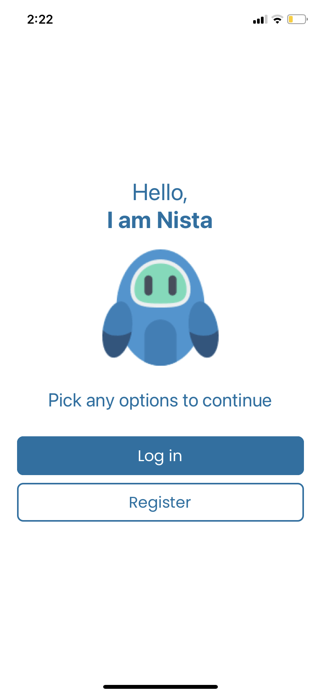

# AI Chat App

The AI Chat App is a real-time messaging application built with React Native. Its primary purpose is to facilitate seamless and instant communication between users and an advanced AI.

## App Availability

You can download the app at [App Link](https://expo.dev/@carrot_28/ai-chat-app)

## Features

-   Real-time Messaging: Users can send and receive messages in real-time, allowing for seamless and immediate communication.

-   Dark Mode Support: Experience enhanced visual comfort with our automatic dark mode detection and switch feature. The app adapts to your environment, making late-night chats easy on the eyes.

-   The app incorporates cutting-edge AI algorithms to generate smart and creative text and images, adding a touch of magic to your conversations.

-   User Authentication: The app includes user authentication functionality, ensuring that only registered users can access the chat features.

-   Secure Backend: Firebase serves as the backend database, offering a secure and reliable infrastructure to store and manage user data and messages.

## Installation

<details>
<summary>
  <code>There are several ways to save this repository on your device. Two of these options include:</code>
</summary>

-   [Downloading repository as ZIP](https://github.com/carrot2803/AI-Chat-App/archive/refs/heads/master.zip)
-   Running the following command in a terminal, provided the [GitHub CLI](https://cli.github.com/) has been previously installed:

```sh
git clone https://github.com/carrot2803/AI-Chat-App.git
```

<code>Install React and dependencies: </code>

Run the following command to install the required dependencies:

```sh
npm i
```

Run the app: Connect your device or emulator, and run the following command to launch the app:

```sh
npm start
```

</details>

## Usage

Upon launching the AI Chat App on your mobile device, you will be presented with the login screen. If you are a new user, you can create an account by providing the required details. Existing users can log in using their credentials. <br/>

Once logged in, you will enter the chat interface, where you can view your conversations, send and receive messages, and interact with other users in real-time.

## Snippets




<br/>


